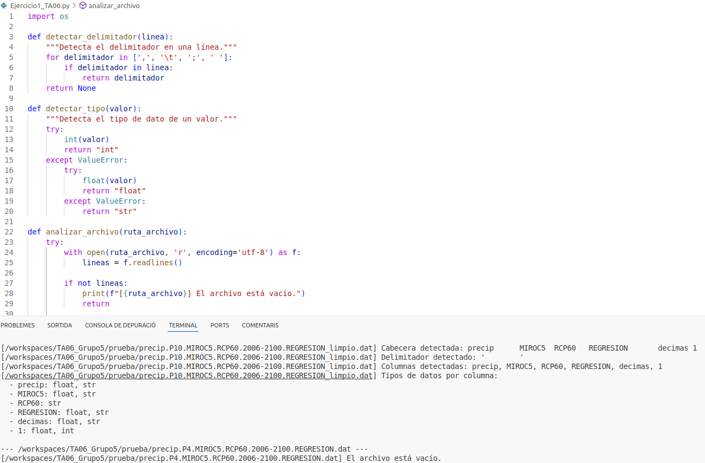
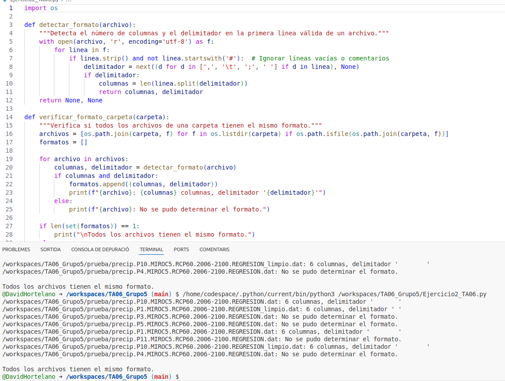
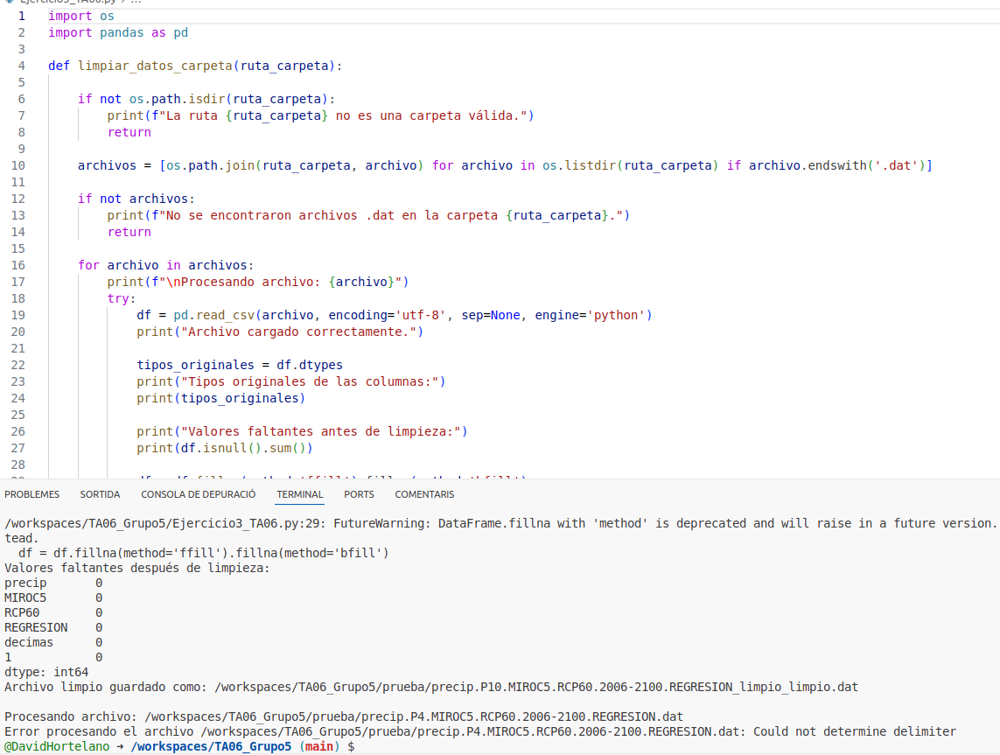
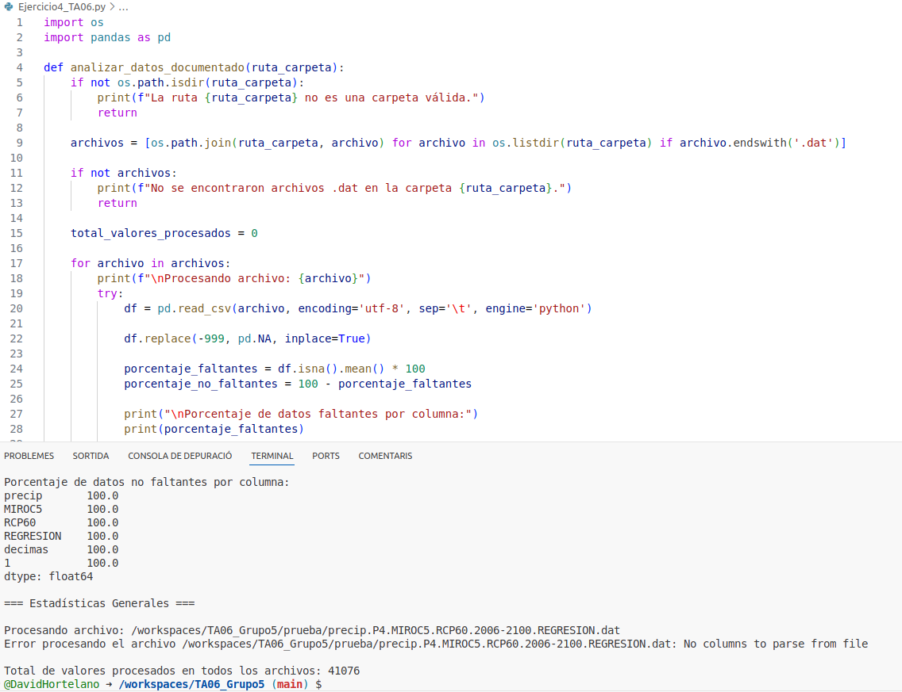

Bienvenido al manual del TA06_Grup5
---
## Indice1
1. [Obtencion de datos](#ejercicio-1)
2. [Organizar y procesar datos](#ejercicio-2)
3. [Generar resultados](#ejercicio-3)
4. [Publicar los resultados](#ejercicio-4)
5. [Reflexion](#ejercicio-5)

---
<!-- Ejercicio 1 -->
# Ejercicio 1
## Obtencion de datos

---
<!-- Ejercicio 2 -->
# Ejercicio 2
## Organizar y procesar datos

**paso 1:** Revisar las cabeceras, separación entre datos, comentarios… Saber cómo están delimitados los datos.
- Para hacer este paso hemos realizado un script el cual nos ayuda a revisar todos los archivos de manera eficiente.

**paso 2:** Verificando que todos los archivos tienen el mismo formato.
- Como en el ejercicio uno la manera mas eficiente era crear un script.

**paso 3:** Limpiar los datos: Asegurar que los datos no contengan errores, valores que falten o inconsistencias.
- Para hacerlo rapidamente y sin mucho trabajo tambien hemos hecho un script.

**paso 4:** Calcular el porcentaje de datos carentes (-999). Calcular estadísticas: de los datos procesados. Medias y totales anuales: Muestra la precipitación total y media por año. Tendencia de cambio: La tasa de variación anual de las precipitaciones. Extremos: Los años más lluviosos y más secos. Analizar los datos: pensar qué estadísticas tiene sentido hacer. Y añadir por lo menos dos más.
- Por ultimo y para completar el ejercicio de manera simetrica hemos generado un script para ayudarnos.

---
<!-- Ejercicio 3 -->
# Ejercicio 3
## Generar resultados

---
<!-- Ejercicio 4 -->
# Ejercicio 4
## Publicar los datos

---
<!-- Ejercicio 5 -->
# Ejercicio 5
## Reflexion
